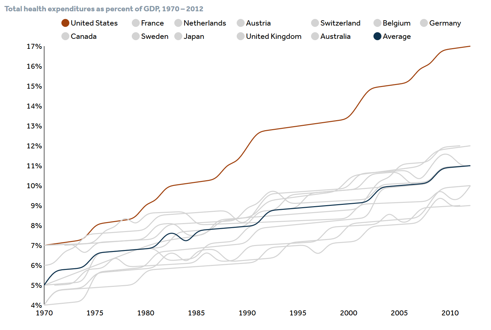
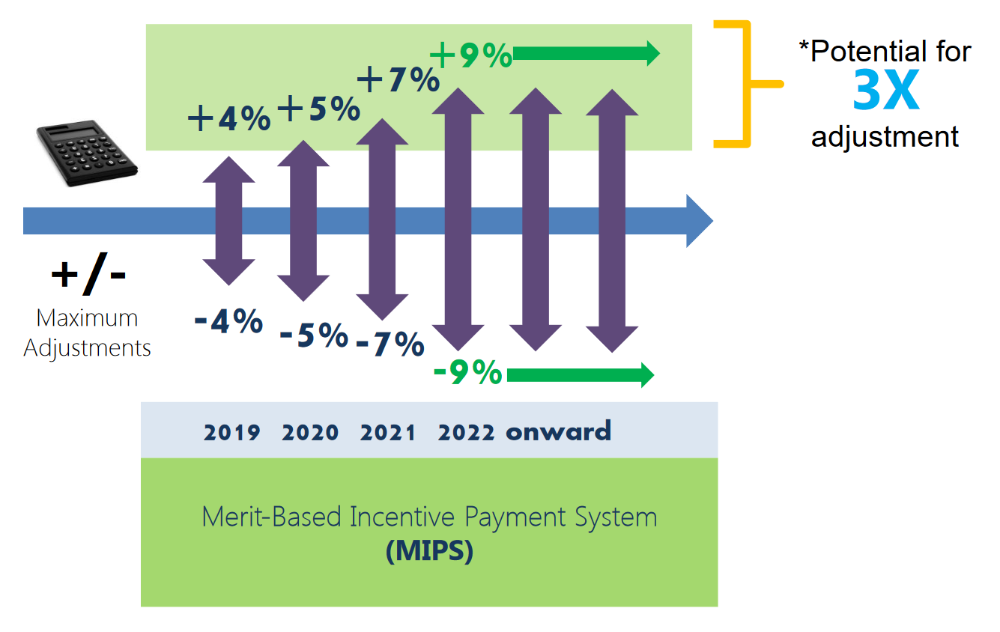

# What's happening? 

## We pay a lot for a little {data-background=#073642}

## Reimbursement based on value {data-background=#eee8d5}

- [We spend more money for less quality and less access to care](http://www.commonwealthfund.org/publications/issue-briefs/2015/oct/us-health-care-from-a-global-perspective)
- [Same $ for effective and ineffective treatment, providers](http://vbidcenter.org/v-bid-in-action-driving-value-through-clinically-nuanced-incentives/)
- [90% of Medicare FFS tied to quality by 2018](https://www.cms.gov/Newsroom/MediaReleaseDatabase/Fact-sheets/Other-Content-Types/2015-01-26-2.PNG)

## Specific initiatives {data-background=#eee8d5}

- [CCBHC](http://www.samhsa.gov/section-223/quality-measures)
- Integrated BH Funding
- [MACRA](http://www.ama-assn.org/ama/pub/advocacy/topics/medicare-physician-payment-reform.page), [MIPS](https://www.cms.gov/Medicare/Quality-Initiatives-Patient-Assessment-Instruments/Value-Based-Programs/MACRA-MIPS-and-APMs/MIPS-Scoring-Methodology-slide-deck.pdf), APM
- [Health Homes](https://www.medicaid.gov/state-resource-center/medicaid-state-technical-assistance/health-homes-technical-assistance/downloads/health-home-core-set-manual.pdf)
- [HBIPS](https://www.qualitycheck.org/)
- [CMS Innovation Models](https://innovation.cms.gov/initiatives/index.html#views=models)

## Five years... {data-background=#073642}

# What's value?

## ☤ / $

## Quality / Resource Use 

## Quick Quiz {data-background=#859900}

Which of the following leads to increased value?

1. More quality, same cost
2. Same quality, same cost
3. Same quality, less cost
4. Less quality, less cost

# What resources? {data-background=#eee8d5}

## ◍ Ingredients to produce outcomes

- Payment ($)
- Time and work, i.e. [Episodes](https://www.cms.gov/Medicare/Quality-Initiatives-Patient-Assessment-Instruments/Value-Based-Programs/MACRA-MIPS-and-APMs/EGM-Design-Report.pdf)

## ◎ Defining resources

- Past efforts (e.g. [DRG](https://www.cms.gov/Medicare/Medicare-Fee-for-Service-Payment/AcuteInpatientPPS/index.html?redirect=/acuteinpatientpps/))
- [CCBHC prospective payment](http://www.samhsa.gov/section-223/certification-resource-guides/prospective-payment-system)

# What's quality? {data-background=#eee8d5}

## ▦ Measurable {data-background=#eee8d5}

If quality services are provided in the middle of the woods and no one documents them, do they make a sound?

## ❉ Standard Measures, Standard Data {data-background=#eee8d5}

- Process and Outcome
- [HEDIS](http://www.ncqa.org/hedis-quality-measurement/hedis-measures), [NQF](http://www.qualityforum.org/QPS/QPSTool.aspx), etc.
- National ([Behavioral](http://www.samhsa.gov/data/national-behavioral-health-quality-framework)) [Health](http://www.ahrq.gov/workingforquality/nqs/nqsfactsheet.pdf) Strategy
- [Common codesets](https://vsac.nlm.nih.gov/) 

# How will it affect me? {data-background=#eee8d5}

## ☑ How you work {data-background=#eee8d5}

- Can we afford to leave process up to choice?
- [Attention to coding practices](http://bok.ahima.org/doc?oid=69799#.V4_vRTX36SQ)
- Process redesign improving data capture and [EMR usability](http://jamia.oxfordjournals.org/content/early/2015/06/06/jamia.ocv050)

## ☛ How you manage {data-background=#eee8d5}

- Payment adjustments are often *per physician*
- How does this impact clinical supervision?  Contracting?

## ☻ Defining "Better" {data-background=#073642}

- [Move toward measurement-based care in behavioral health treatment](http://thekennedyforum-dot-org.s3.amazonaws.com/documents/KennedyForum-MeasurementBasedCare_2.pdf)
- [Only 11% of psychologists routinely administer symptom scales](http://www.ncbi.nlm.nih.gov/pubmed/19916162)
- [Tools are already available for use](http://thekennedyforum-dot-org.s3.amazonaws.com/documents/MBC_supplement.pdf), (e.g. [DSM5 measures](https://www.psychiatry.org/psychiatrists/practice/dsm/dsm-5/online-assessment-measures), [PROMIS](http://www.healthmeasures.net/explore-measurement-systems/promis) )

# One example...

## ⊷ Metabolic Monitoring {data-background=#eee8d5}

- Diabetes Screening for People With Schizophrenia or Bipolar Disorder Who Are Using Antipsychotic Medications ([NQF 1932](http://www.qualityforum.org/QPS/1932))
- Well documented [clinical guidelines](http://care.diabetesjournals.org/content/27/2/596.full?ijkey) and [tools](http://www.cqaimh.org/pdf/tool_metabolic.pdf) for over a decade
- How hard could it be?

## ☂ Challenges

- Data capture
- Communication / interoperability
- Requires patient activation
- Accountability across systems

# ✎ By...

----

## ☀ ☼ ☁ ☂ ★ ☎ ☑ ☔ ☤ ☺ ☻ ♡ ♥ ♺ ♻
## ↺ ≅ ⊞ ⊷  ▦  ► ◀ ◉ ◍ ◎ ◐ ✿❆❉ ☛
